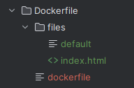
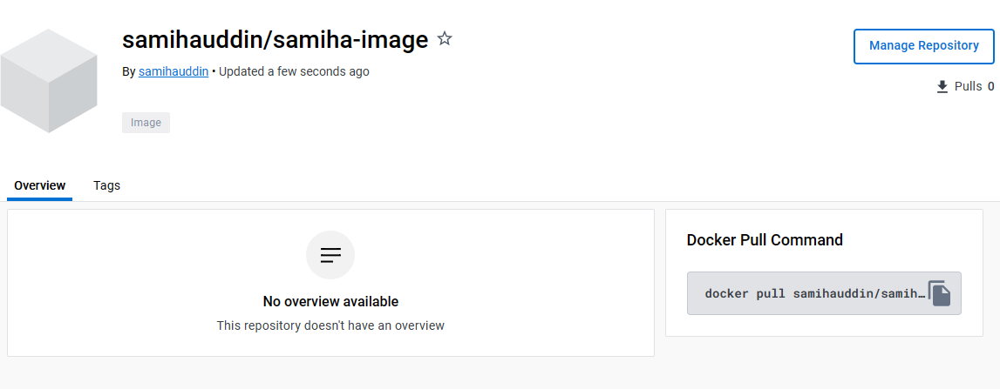

### What is Microservices?

Microservices is an architectural style that structures an application as a collection of small, loosely coupled services.

These services are designed to be highly maintainable, testable, and scalable. 

### What is Docker?

Docker is a platform for developing, shipping, and running applications inside containers. 

Containers are lightweight, portable, and self-sufficient units that can run applications and their dependencies. 

### Benefits of Docker for a business?

- **Easy Portability:** Applications can run on any machine without compatibility issues.

- **Isolation and Security:** Applications run securely without interfering with each other.

- **Efficient Resource Use:** Maximizes the use of server resources, saving costs.

- **Quick Deployment:** Applications can be deployed rapidly, responding to demand swiftly.

- **Scalability:** Easy to scale up or down based on workload.

- **Version Control:** Keeps track of changes and allows easy rollback if issues occur.

- **Simplified Testing:** Eases testing in various environments without complications.

### Setting up Docker & Useful commands

Check if Docker is installed:
```
# Check if Docker is instlled 
docker

# Check Docker version
docker --version
```

Build an image:
```
docker build -t <image name>
```

List all Docker images:
```
docker images
```

Run a Docker container:
```
docker run
```
List all running containers:
```
docker ps
```
List all containers:
```
docker ps -a
```
Stop a running container:
```
docker stop <container ID>
```
Remove a container:
```
docker rm <container ID> -f
```
Remove an image:
```
docker rmi <image name> -f
```
Push an Image:
```
docker push <image name>
```
Running a command inside a Docker container:
```
docker exec -it <ID> sh
apt update -y
apt upgrade -y
apt install sudo
apt install nano

cd /usr
cd share
cd nginx
cd html

pwd
ls
cat index.html
sudo nano index.html
```
### Building an Image and Pushing to Docker Hub

**Step 1:** Manually create a new Directory 
- Inside the create a `dockerfile` with no extension



**Step 2:** Create an index.html file inside the new directory `Docker` and save
```
<h1>Samiha Uddin</h1>
<p>Samiha is a driven and dedicated Psychology graduate with a strong desire and determination to advance in the Technology sector.</p>

<p>For online documentation and support please refer to
<a href="http://nginx.org/">nginx.org</a>.<br/>
Commercial support is available at
<a href="http://nginx.com/">nginx.com</a>.</p>

<p><em>Thank you for using nginx.</em></p>
</body>
</html>
```
**Step 3:** Create a default file inside the new directory `Docker` and save
```
server {
    listen 80 default_server;
    listen [::]:80 default_server;
    
    root /usr/share/nginx/html;
    index index.html index.htm;

    server_name _;
    location / {
        try_files $uri $uri/ =404;
    }
}
```
**Step 4:** In your dockerfile enter the following:
```
FROM ubuntu:18.04  
LABEL maintainer="samihauddin@live.co.uk" 
RUN  apt-get -y update && apt-get -y install nginx
COPY files/default /etc/nginx/sites-available/default
COPY files/index.html /usr/share/nginx/html/index.html
EXPOSE 80
CMD ["/usr/sbin/nginx", "-g", "daemon off;"]
```
**Step 5:** Build your image
```
docker build -t imagename .
```
**Step 6:** Check if image has been created
```
# lists the docker images
docker images

# image will be running on port 81 forwarding requests to port 80 inside the container
docker run -d -p 81:80 samiha-image:v1

# check if you are logged into docker
docker login
```
**Step 7:** Create a tag
```
docker tag samiha-image:v1 samihauddin/samiha-image:v1
```
**Step 8:** Push your image to Docker Hub
```
docker push samihauddin/samiha-image:v1
```

**Successful Output**

