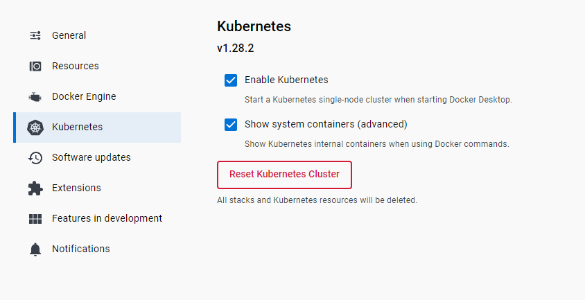

### What is Kubernetes (K8)?

Kubernetes is an open-source platform designed to automate deploying, scaling, and operating application containers. 

It groups containers that make up an application into logical units for easy management and discovery.

K8 deployment needs multiple instances called `pods`
each pod has its own ip, that's why it is attachable and detachable.

### Why do we need k8?

K8 allows docker containers to become scalable by creating k8 deployment replicas so if one goes down the others will be unaffected. The load balancer diverts the traffic and reroutes the traffic.

### What are the benefits of k8?

**Scalability:** Easily scale your applications up or down to handle varying workloads.

**Portability:** Run your applications consistently across different environments, whether it's on-premises, in the cloud, or a hybrid of both.

**Resource Efficiency:** Optimize the use of your hardware resources, ensuring applications run efficiently without wasting computing power.

**Automated Operations:** Automate deployment, scaling, and management tasks, reducing manual intervention and human errors.

**High Availability:** Ensure your applications are highly available and fault-tolerant by distributing them across multiple nodes and data centers.

### K8 Architecture?

### When not to use it?
- If your application is small and has minimal complexity, using Kubernetes might be overkill.
- If your workloads are consistent, predictable, and don't need to scale or change frequently

### Enabling K8 on Docker Desktop



### Kubernetes commands 

Check if K8 is running 
```
kubectl
```
Check if cluster is running
```
kubectl get service
kubectl get svc
```