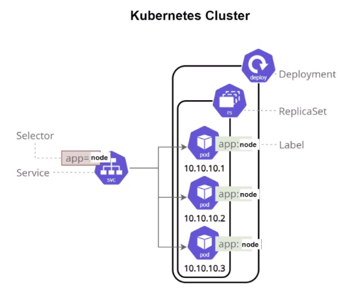
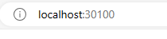
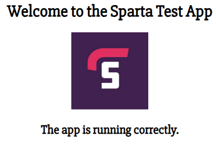
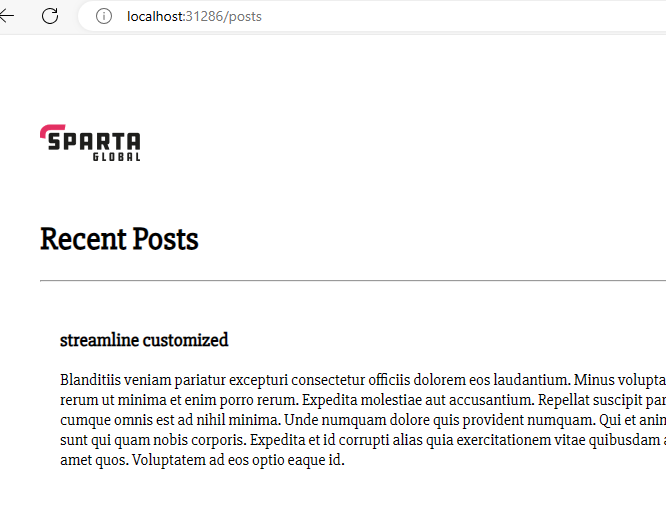

### What is Kubernetes (K8)?

Kubernetes is an **open-source platform** designed to **automate deploying, scaling, and operating** application containers. 


### Why do we need k8?

- K8 allows docker containers to become scalable by creating **k8 deployment replicas** so if one goes down the others will be unaffected. 
- The load balancer diverts the traffic and reroutes the traffic.

### What are the benefits of k8?

**Scalability:** Easily scale your applications up or down to handle varying workloads.

**Portability:** Run your applications consistently across different environments, whether it's on-premises, in the cloud, or a hybrid of both.

**Resource Efficiency:** Optimize the use of your hardware resources, ensuring applications run efficiently without wasting computing power.

**Automated Operations:** Automate deployment, scaling, and management tasks, reducing manual intervention and human errors.

**High Availability:** Ensure your applications are highly available and fault-tolerant by distributing them across multiple nodes and data centers.

### K8 Architecture?


K8 deployment needs multiple instances called **pods**. Each pod has its own ip, that's why it is attachable and detachable.

### When not to use it?
- If your application is small, minimal complexity, using Kubernetes might be overkill.
- If your workloads are consistent, predictable, and don't need to scale or change frequently
- Limited resources

### Enabling K8 on Docker Desktop
- Navigate to Docker Desktop
- Select `settings`
- Enable Kubernetes
- Select `Apply and Restart`


### Kubernetes commands 

Check if K8 is running 
```
kubectl
```
Check if cluster is running
```
kubectl get service
kubectl get svc
```
### Creating a YAML file to create PODS
**Step 1:** Create a yaml file and input the following (Indentation is very important).
```
apiVersion: apps/v1
kind: Deployment
metadata:
  name: nginx-deployment
spec:
  selector:
    matchLabels:
      app: nginx
  replicas: 3
  template:
    metadata:
      labels:
        app: nginx
    spec:
      containers:
        - name: nginx
          image: samihauddin/nginx-254:latest
          ports:
            - containerPort: 80
```
**Step 2:** Run the YAML file to create the pods <br>

```
# Creating pods
kubectl create -f nginx-deploy.yml

# Verifying if the pods are running
kubectl get pods
```


**Step 3:** Deleting a Pod
```
kubectl delete pod <name-of-pod>
```

### Enabling Nginx pod to run

**Step 1:** Create a YAML file `nginx-service.yml`

**Step 2:** Inside the file input the following:

```
apiVersion: v1
kind: Service
metadata:
  name: nginx-service
spec:
  selector:
    app: nginx
  ports:
    - protocol: TCP
      port: 80
      nodePort: 30080
  type: NodePort
```
**Step 3:** Run the YAML file
```
kubectl create -f nginx-service.yml
```
**Successful output:**

Your Nginx pods should now be running when you search `localhost:30080` in your web browser.

**Node port rages from 30000-32767**

### K8 Clusters

A cluster in Kubernetes consists of a master node (which manages the cluster) and worker nodes (where applications run). 

The master node controls and manages the cluster's state, including scaling, upgrades, and deployments.



### Deploy Node-app in the same cluster

**Step 1:** Create a file `node-deploy.yml`

Input the following:

```
apiVersion: apps/v1
kind: Deployment
metadata:
  name: node-deploy
spec:
  replicas: 2  
  selector:
    matchLabels:
      app: node-app
  template:
    metadata:
      labels:
        app: node-app
    spec:
      containers:
        - name: node-app
          image: samihauddin/sparta-app-2:latest 
          ports:
            - containerPort: 3000 
```

**Step 2:** Create `node-service.yml`

Input the following:
```
apiVersion: v1
kind: Service
metadata:
  name: node-service
spec:
  selector:
    app: node-app
  type: NodePort
  ports:
    - protocol: TCP
      port: 3000
      targetPort: 3000
      nodePort: 30100
```
**Successful output:**




### Mongo DB Cluster 

1. Create a Directory containing your dockerfile and mongod.conf

```
# Use an official MongoDB image as a base
FROM mongo:4.4
 
# Copy a custom mongod.conf file that allows all connections
COPY mongod.conf /etc/mongod.conf.orig
 
# Expose the default MongoDB port
EXPOSE 27017
 
# Specify the command to run MongoDB with the custom config file
CMD ["mongod"]
```
```
# mongod.conf

# for documentation of all options, see:
#   http://docs.mongodb.org/manual/reference/configuration-options/

# Where and how to store data.
storage:
  dbPath: /var/lib/mongodb
#  engine:
#  wiredTiger:

# where to write logging data.
systemLog:
  destination: file
  logAppend: true
  path: /var/log/mongodb/mongod.log

# network interfaces
net:
  port: 27017
  bindIp: 0.0.0.0


# how the process runs
processManagement:
  timeZoneInfo: /usr/share/zoneinfo

#security:

#operationProfiling:

#replication:

#sharding:

## Enterprise-Only Options:

#auditLog:
```
2. Build your image 
```
docker build -t <db image> .
```
3. Run the image 
4. Push to docker hub

### Creating Mongo deployment and service YAML file 

Deployment file
```
# Use spaces not a tab

apiVersion: apps/v1 # which API to use for deployment
kind: Deployment # pod - service what kind of service/object

metadata:
  name: mongo-deploy-2 # naming the deployment
spec:
  selector:
    matchLabels:
      app: mongo # look for this label to match with k8 service
    # lets create a replica set of this with instances/pods
  replicas: 3 #3 pods
    # template to use its label for k8 service to launch in the browser
  template:
    metadata:
      labels:
        app: mongo # This label connects to the service or any other K8 components
  # Lets define the container spec
    spec:
      containers:
      - name: mongo
        image: samihauddin/db:latest # use the image that you built in your dockerhub
        ports:
        - containerPort: 27017
```
Service file
```
apiVersion: v1
kind: Service
metadata:
  name: mongo-service
spec:
  selector:
    app: mongo
  ports:
    - protocol: TCP
      port: 27017
      targetPort: 27017
  type: NodePort
```
Run the yaml file

```
kubectl create -f mongo-deploy-2.yml
kubectl create -f mongo-service.yml
```

### Creating an Environment variable

In the node-deploy.yml file add the environment variable 
```
apiVersion: apps/v1
kind: Deployment
metadata:
  name: node-deploy
spec:
  replicas: 2  # Adjust the number of replicas based on your computer's capacity
  selector:
    matchLabels:
      app: node-app
  template:
    metadata:
      labels:
        app: node-app
    spec:
      containers:
        - name: node-app
          image: samihauddin/sparta-app-2:latest  # Replace with your Node.js app image
          ports:
            - containerPort: 3000  # Adjust if your app listens on a different port
          env: 
          - name: DB_HOST
            value: mongodb://10.99.20.212:27017/posts
          lifecycle:
            postStart:
              exec:
                command: ["/bin/sh","-c",node seeds/seed.js]
```
Service file 
```
apiVersion: v1
kind: Service
metadata:
  name: node-service
spec:
  selector:
    app: node-app
  ports:
    - protocol: TCP
      port: 3000
      targetPort: 3000
  type: NodePort
```
Re-run the node deployment and service
```
kubectl create -f node-deploy-2.yml
kubectl create -f node-service.yml
```

**Successful output:**

