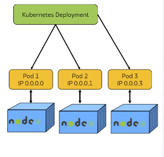
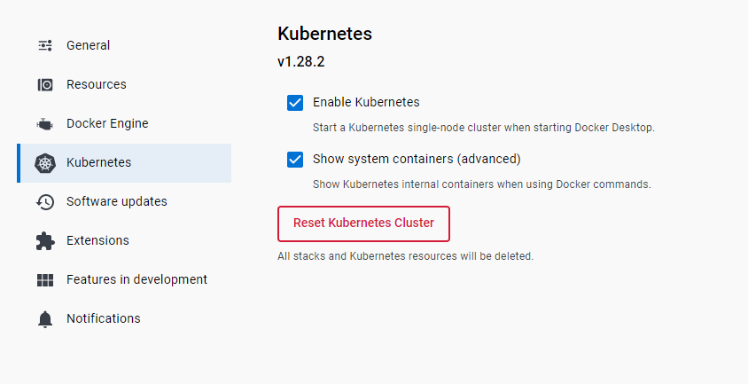
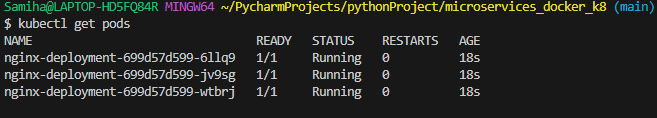
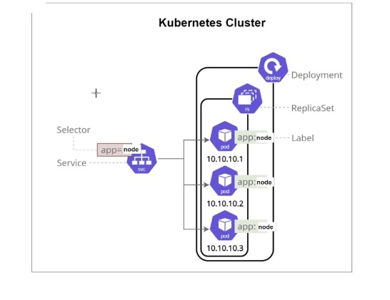

### What is Kubernetes (K8)?

Kubernetes is an **open-source platform** designed to **automate deploying, scaling, and operating** application containers. 


### Why do we need k8?

- K8 allows docker containers to become scalable by creating **k8 deployment replicas** so if one goes down the others will be unaffected. 
- The load balancer diverts the traffic and reroutes the traffic.

### What are the benefits of k8?

**Scalability:** Easily scale your applications up or down to handle varying workloads.

**Portability:** Run your applications consistently across different environments, whether it's on-premises, in the cloud, or a hybrid of both.

**Resource Efficiency:** Optimize the use of your hardware resources, ensuring applications run efficiently without wasting computing power.

**Automated Operations:** Automate deployment, scaling, and management tasks, reducing manual intervention and human errors.

**High Availability:** Ensure your applications are highly available and fault-tolerant by distributing them across multiple nodes and data centers.

### K8 Architecture?



K8 deployment needs multiple instances called **pods**. Each pod has its own ip, that's why it is attachable and detachable.

### When not to use it?
- If your application is small, minimal complexity, using Kubernetes might be overkill.
- If your workloads are consistent, predictable, and don't need to scale or change frequently
- Limited resources

### Enabling K8 on Docker Desktop
- Navigate to Docker Desktop
- Select `settings`
- Enable Kubernetes
- Select `Apply and Restart`



### Kubernetes commands 

Check if K8 is running 
```
kubectl
```
Check if cluster is running
```
kubectl get service
kubectl get svc
```
### Creating a YAML file to create PODS
**Step 1:** Create a yaml file and input the following (Indentation is very important).
```
apiVersion: apps/v1
kind: Deployment
metadata:
  name: nginx-deployment
spec:
  selector:
    matchLabels:
      app: nginx
  replicas: 3
  template:
    metadata:
      labels:
        app: nginx
    spec:
      containers:
        - name: nginx
          image: samihauddin/nginx-254:latest
          ports:
            - containerPort: 80
```
**Step 2:** Run the YAML file to create the pods <br>

```
# Creating pods
kubectl create -f nginx-deploy.yml

# Verifying if the pods are running
kubectl get pods
```


**Step 3:** Deleting a Pod
```
kubectl delete pod <name-of-pod>
```

### Enabling Nginx pod to run

**Step 1:** Create a YAML file `nginx-service.yml`

**Step 2:** Inside the file input the following:

```
apiVersion: v1
kind: Service
metadata:
  name: nginx-service
spec:
  selector:
    app: nginx
  ports:
    - protocol: TCP
      port: 80
      nodePort: 30010
  type: NodePort
```
**Step 3:** Run the YAML file
```
kubectl create -f nginx-service.yml
```
**Successful output:**

Your Nginx pods should now be running when you search `localhost:30010` in your web browser.


### K8 Clusters

A cluster in Kubernetes consists of a master node (which manages the cluster) and worker nodes (where applications run). 

The master node controls and manages the cluster's state, including scaling, upgrades, and deployments.


