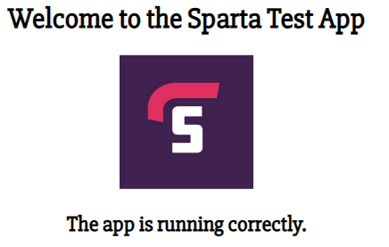

### What is Microservices?

- Microservices architecture simplifies complex applications by breaking them down into smaller, independent services.

### What are the benefits of microservices?

- These services can be developed, deployed, and scaled independently, leading to benefits such as agility, scalability, fault isolation, and improved maintainability. <br>


- This modularity allows teams to work more efficiently, choose diverse technologies, and deploy services easily, streamlining the development and maintenance processes.

### Task 1

#### Setting up Sparta Test App through Docker container 

**Step 1.** Create a Directory with the app folder and a docker file

**Step 2.** inside the docker file enter:
```
FROM node:12
COPY app .
RUN npm install pm2 -g
RUN pm2 start app.js
EXPOSE 3000
CMD [ "node", "app.js" ]
```
**Step 3.** Build an image
```
docker build -t sparta-app-2 .
```
**Step 4.** check if image has been created 
```
docker images
```
**Step 5.** Build the container
```
docker run -d -p 3000:3000 sparta-app-2
```
**Step 6.** Check if it is working on localhost:3000

**Successful output**



**Step 7.** Create tag 
```
docker tag sparta-app-2 samihauddin/sparta-app-2:latest
```
**Step 8.** Push to Dockerhub 
```
docker push samihauddin/sparta-app-2
```

**Successful output** 


### Task 2

#### Setting up DB through Docker container

Step 1:

```

```

Step 2:

```

```

Step 3:

```

```

Step 4:

```

```

Step 5:

```

```

Step 6:

```

```

Step 7:

```

```

Step 8:

```

```

Step 9:

```

```

**Successful output**
